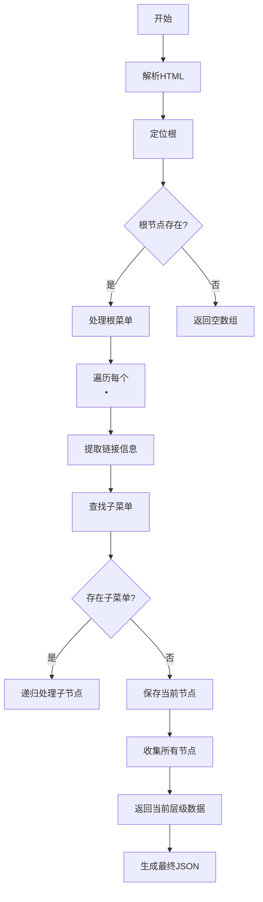

以下是代码的逐步解析：

```python
from bs4 import BeautifulSoup
import json
import re

def parse_sidebar(html):
    # 创建BeautifulSoup解析器对象，使用html.parser作为解析引擎
    soup = BeautifulSoup(html, 'html.parser')
    
    # 定义递归函数处理每个菜单层级
    def process_node(ul_node):
        items = []  # 当前层级的菜单项列表
        
        # 查找所有包含'td-sidebar-nav__section'类的<li>标签（仅直接子节点）
        for li in ul_node.find_all('li', class_=lambda x: x and 'td-sidebar-nav__section' in x.split()):
            
            # 在<li>中查找带'td-sidebar-link'类的<a>标签
            link = li.find('a', class_='td-sidebar-link')
            if not link:
                continue  # 跳过没有链接的菜单项
                
            # 构建节点数据结构
            node = {
                "id": link.get('id', '').strip(),  # 从a标签提取id属性
                "url": link.get('href', '').strip(),  # 提取href链接
                "text": link.get_text(strip=True),  # 提取可见文本
                "children": []  # 初始化子菜单
            }
            
            # 查找嵌套的子菜单（包含'foldable'类的<ul>）
            child_ul = li.find('ul', class_=lambda x: x and 'foldable' in x.split())
            if child_ul:
                # 递归处理子菜单
                node['children'] = process_node(child_ul)
            
            items.append(node)
        return items
    
    # 定位根菜单容器（class为ul-1的<ul>）
    root_ul = soup.find('ul', class_='ul-1')
    
    # 如果找不到根节点则返回空数组
    return process_node(root_ul) if root_ul else []

# 使用示例
if __name__ == "__main__":
    # 读取HTML文件
    with open('k8s.html', 'r', encoding='utf-8') as f:
        html_content = f.read()
    
    try:
        # 解析菜单数据
        menu_data = parse_sidebar(html_content)
        # 美化输出JSON
        print(json.dumps(menu_data, indent=2, ensure_ascii=False))
    except Exception as e:
        print(f"Error: {str(e)}")
```

### 流程图解


### 关键组件说明

1. **HTML解析器选择**
```python
soup = BeautifulSoup(html, 'html.parser')
```
- 使用Python内置的`html.parser`，无需额外安装依赖
- 适用于大多数标准HTML文档

2. **动态类名匹配**
```python
class_=lambda x: x and 'td-sidebar-nav__section' in x.split()
```
- 使用lambda函数实现部分类名匹配
- 解决HTML元素可能包含多个类名的情况（如`class="td-sidebar-nav__section with-child"`）

3. **递归处理逻辑**
```python
def process_node(ul_node):
    ...
    node['children'] = process_node(child_ul)
```
- 深度优先遍历菜单树
- 自动处理无限层级嵌套结构

4. **数据清洗规范**
```python
"id": link.get('id', '').strip(),
"url": link.get('href', '').strip(),
"text": link.get_text(strip=True)
```
- `strip()`方法去除空白字符
- 提供默认值防止KeyError

### 常见问题处理方案

#### 问题1：无法找到根节点
**现象**：输出空数组或报错
**排查步骤**：
1. 确认HTML中是否存在`<ul class="ul-1">`
```python
# 在代码中添加调试语句
print("找到的<ul>数量:", len(soup.find_all('ul')))
print("第一个<ul>的类:", soup.find('ul').get('class'))
```

2. 修改根节点选择逻辑（改为更通用的选择方式）
```python
# 改为查找第一个包含'td-sidebar-nav'的<ul>
root_ul = soup.find('ul', class_=lambda x: x and 'td-sidebar-nav' in x.split())
```

#### 问题2：遗漏部分菜单项
**现象**：生成的JSON缺少某些节点
**解决方案**：
1. 检查类名匹配规则
```python
# 修改为匹配所有带sidebar-link的<a>标签
link = li.find('a', class_=lambda x: x and 'td-sidebar-link' in x.split())
```

2. 添加未识别结构的处理
```python
# 在for循环中添加备用选择逻辑
if not link:
    link = li.find('span', class_='td-sidebar-link-text')
    if link:
        node['text'] = link.get_text()
```

#### 问题3：ID冲突或重复
**现象**：生成的JSON中出现重复ID
**解决方案**：
```python
# 添加ID生成策略
import hashlib
item_id = link.get('id') or hashlib.md5(link['href'].encode()).hexdigest()[:8]
```

### 性能优化建议

1. **限制递归深度**
```python
def process_node(ul_node, depth=0):
    if depth > 5:  # 防止无限递归
        return []
    ...
```

2. **使用缓存加速解析**
```python
from functools import lru_cache

@lru_cache(maxsize=100)
def get_classes(element):
    return element.get('class') or []
```

3. **异步处理大规模数据**
```python
import asyncio

async def async_parse(html):
    loop = asyncio.get_event_loop()
    return await loop.run_in_executor(None, parse_sidebar, html)
```

### 完整调用示例

**输入HTML**：
```html
<ul class="ul-1">
  <li class="td-sidebar-nav__section with-child">
    <a href="/docs/home" class="td-sidebar-link">Home</a>
    <ul class="ul-2 foldable">
      <li class="td-sidebar-nav__section">
        <a href="/docs/home/details" class="td-sidebar-link">Details</a>
      </li>
    </ul>
  </li>
</ul>
```

**输出JSON**：
```json
[
  {
    "id": "",
    "url": "/docs/home",
    "text": "Home",
    "children": [
      {
        "id": "",
        "url": "/docs/home/details",
        "text": "Details",
        "children": []
      }
    ]
  }
]
```

通过调整选择器逻辑和增加容错处理，可以确保代码适配各种变形的HTML侧边栏结构。