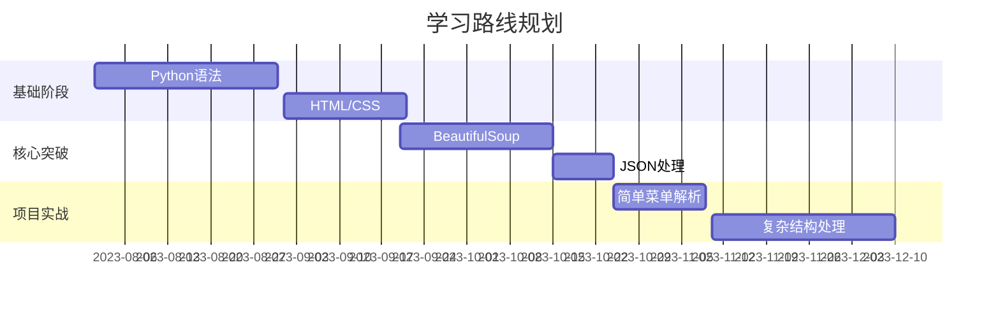

作为小白要完整掌握这类代码的编写，需要循序渐进地培养以下核心能力，以下是具体的学习路径和建议：

---

### 一、**编程基础能力**
1. **Python语法基础**（30小时）
   - ✅ 掌握：
     - 变量、数据类型（字符串/列表/字典）
     - 条件判断（`if-elif-else`）
     - 循环（`for`/`while`）
     - 函数定义与参数传递
     - 文件读写操作（`open()`）
   - 🚀 练习：
     ```python
     # 练习：统计文本中单词频率
     with open('text.txt') as f:
         words = f.read().split()
     word_count = {}
     for word in words:
         word_count[word] = word_count.get(word, 0) + 1
     print(word_count)
     ```

2. **数据结构操作**（15小时）
   - 重点掌握：
     - 列表推导式：`[x*2 for x in range(10)]`
     - 字典的合并与嵌套：`{"user": {"name": "Alice", "age": 25}}`
     - JSON与字典的互转：`json.dumps()` / `json.loads()`

---

### 二、**Web技术理解**
1. **HTML结构认知**（10小时）
   - 关键知识点：
     - 标签结构：`<ul><li>Item</li></ul>`
     - 类选择器：`class="menu-item"`
     - 属性获取：`<a href="/docs">` → `href`属性
   - 🔍 快速识别练习：
     ```html
     <!-- 找出所有带链接的菜单项 -->
     <div class="sidebar">
       <ul>
         <li><a href="/home" class="link">Home</a></li>
         <li><span>No Link</span></li>
       </ul>
     </div>
     ```

2. **CSS选择器入门**（8小时）
   - 掌握选择器语法：
     - 类选择器：`.td-sidebar-link`
     - 层级选择：`ul.foldable > li`
   - 在线练习：[CSS Diner游戏](https://flukeout.github.io/)

---

### 三、**核心库专项突破**
1. **BeautifulSoup深度掌握**（20小时）
   - 核心方法：
     ```python
     soup.find('div', class_='header')  # 找单个元素
     soup.find_all('a', href=True)      # 找所有符合元素
     element.get('id')                  # 获取属性值
     ```
   - 🔧 实战技巧：
     - 处理动态类名：`class_=lambda x: x and 'active' in x.split()`
     - 处理嵌套结构：`div.find_next_sibling('ul')`

2. **JSON数据处理**（5小时）
   - 关键操作：
     - 序列化：`json.dumps(data, indent=2)`
     - 确保中文可读：`ensure_ascii=False`
     - 数据清洗：去除空值、格式化文本

---

### 四、**调试与问题解决**
1. **基础调试能力**（15小时）
   - 必备技能：
     - 使用`print()`输出中间结果
     - 阅读报错信息（如`AttributeError`）
     - 使用VS Code的断点调试
   - 🐞 调试案例：
     ```python
     # 遇到NoneType问题时：
     print("当前元素:", element)  # 查看是否为None
     print("元素类型:", type(element))
     ```

2. **递归思维训练**（10小时）
   - 理解递归执行流程：
     ```mermaid
     graph LR
     A[处理节点] --> B{是否有子节点?}
     B -->|是| C[递归处理子节点]
     B -->|否| D[返回结果]
     ```
   - 练习：用递归计算斐波那契数列

---

### 五、**实战项目演练**
1. **分阶段练习**（40小时）
   - 第一阶段：简单菜单解析
     ```html
     <ul class="menu">
       <li><a href="/">Home</a></li>
       <li><a href="/about">About</a></li>
     </ul>
     ```
   - 第二阶段：处理多级嵌套
     ```html
     <ul class="main-menu">
       <li>
         <a href="/products">Products</a>
         <ul class="submenu">
           <li><a href="/products/1">Item 1</a></li>
         </ul>
       </li>
     </ul>
     ```
   - 第三阶段：应对复杂结构（含无效标签、异常数据）

2. **代码优化方向**
   - 添加异常处理：
     ```python
     try:
         child_ul = li.find('ul')
     except AttributeError as e:
         print(f"解析出错: {str(e)}")
     ```
   - 生成更友好的ID：
     ```python
     import hashlib
     item_id = link.get('id') or hashlib.md5(link['href'].encode()).hexdigest()[:6]
     ```

---

### 六、**学习资源推荐**
1. **免费教程**：
   - Python基础：[廖雪峰Python教程](https://www.liaoxuefeng.com/wiki/1016959663602400)
   - HTML/CSS：[MDN Web文档](https://developer.mozilla.org/zh-CN/)
   - BeautifulSoup：[官方文档](https://www.crummy.com/software/BeautifulSoup/bs4/doc/)

2. **实战平台**：
   - [Codewars](https://www.codewars.com/)（搜索"HTML parsing"题目）
   - [LeetCode](https://leetcode.com/)（字符串处理类题目）

3. **工具准备**：
   - 开发环境：VS Code + Python插件
   - 调试工具：Chrome开发者工具（查看网页结构）

---

### 七、**学习路线图**


---

通过以上系统性训练，你不仅能掌握当前代码的编写，还能获得独立开发类似数据解析工具的能力。遇到具体问题时，可以多尝试以下方法：
1. **分解问题**：把大问题拆解成函数/步骤
2. **可视化调试**：用`print()`输出中间数据结构
3. **小步验证**：每写5行代码就测试一次功能

坚持每天2小时刻意练习，3个月左右就能独立完成此类项目！