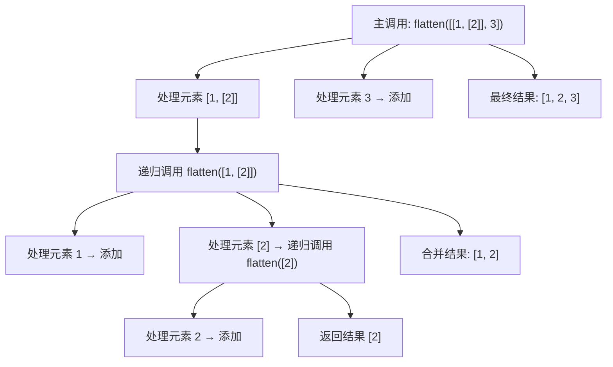

在 Python 中，`x if condition else y` 是一种 **条件表达式**（ternary conditional operator），其语法规则如下：

---

### 一、基础语法结构
```python
结果 = 值A if 条件 else 值B
```
- **执行顺序**：
  1. 先判断 `条件` 是否为真（True）
  2. 如果条件为真 → 返回 `值A`
  3. 如果条件为假 → 返回 `值B`

---

### 二、代码示例
#### 示例 1：基本用法
```python
age = 20
status = "成年人" if age >= 18 else "未成年人"
print(status)  # 输出: 成年人
```

#### 示例 2：配合函数返回值
```python
def get_discount(is_member):
    return 0.9 if is_member else 1.0

print(get_discount(True))   # 输出: 0.9
print(get_discount(False))  # 输出: 1.0
```

#### 示例 3：处理字符串
```python
text = "apple"
result = text.upper() if len(text) > 5 else text.lower()
print(result)  # 输出: apple（长度5不满足条件）
```

---

### 三、与传统 if-else 的对比
#### 传统写法（多行）
```python
if condition:
    result = value_a
else:
    result = value_b
```

#### 条件表达式（单行）
```python
result = value_a if condition else value_b
```

**优势**：更简洁，适合简单逻辑的场景。

---

### 四、嵌套条件表达式
可以嵌套多层条件，但需注意可读性：
```python
score = 85
grade = "A" if score >= 90 else ("B" if score >= 80 else "C")
print(grade)  # 输出: B
```

---

### 五、注意事项
1. **优先级问题**  
   条件表达式的优先级较低，必要时用括号明确运算顺序：
   ```python
   # 错误写法（可能意外计算）
   x = 10 + 5 if condition else 20
   # 正确写法（用括号分组）
   x = (10 + 5) if condition else 20
   ```

2. **短路求值**  
   条件表达式会短路求值，只计算最终选中的分支：
   ```python
   def true_func():
       print("执行真分支")
       return 10

   def false_func():
       print("执行假分支")
       return 20

   result = true_func() if True else false_func()
   # 输出: "执行真分支"（false_func 不会被调用）
   ```

---

### 六、与其他语言的对比
| 语言      | 类似语法                 | 示例                     |
|-----------|--------------------------|--------------------------|
| Python    | `x if cond else y`        | `a = 5 if flag else 0`    |
| JavaScript| `cond ? x : y`            | `let a = flag ? 5 : 0;`   |
| C++       | `cond ? x : y`            | `int a = flag ? 5 : 0;`   |

---

### 七、最佳实践
- **适用场景**：简单逻辑的条件赋值、返回值等。
- **避免场景**：  
  - 复杂条件逻辑（应改用完整的 if-else 结构）
  - 需要执行多个语句的分支（条件表达式只能返回一个值）

---

通过掌握这种语法，可以显著提升代码的简洁性和可读性，尤其在需要单行完成条件判断的场景下非常实用。


这行代码的作用是**递归展开嵌套的子列表，并将其元素添加到结果列表中**。以下是详细解释：

---

### **代码解析**
```python
result.extend(flatten(element))
```
- **`flatten(element)`**：  
  递归调用 `flatten` 函数处理当前子列表 `element`，返回一个已展开的一维列表。
  
- **`result.extend(...)`**：  
  将递归处理后的扁平列表的所有元素逐个添加到 `result` 列表中。

---

### **示例流程**
假设输入为 `[[1, [2]], 3]`：
1. **首次调用 `flatten([[1, [2]], 3])`**  
   - 遍历第一个元素 `[1, [2]]`（列表类型）
   - 递归调用 `flatten([1, [2]])`  
     - 遍历 `1`（非列表）→ 添加到子结果 `[1]`
     - 遍历 `[2]`（列表）→ 递归调用 `flatten([2])` → 返回 `[2]`
     - 子结果通过 `extend` 合并为 `[1, 2]`
   - 主结果通过 `extend` 添加 → `[1, 2]`
2. **处理第二个元素 `3`**  
   - 非列表类型 → 直接添加 → 主结果变为 `[1, 2, 3]`

---

### **与 `append` 的区别**
| 方法       | 行为                          | 示例                      |
|------------|-------------------------------|--------------------------|
| `extend`   | 添加可迭代对象的所有元素        | `[1].extend([2,3]) → [1,2,3]` |
| `append`   | 将整个对象作为单个元素添加      | `[1].append([2,3]) → [1, [2,3]]` |

---

### **为何必须用 `extend`？**
- **递归结果已展开**：`flatten(element)` 返回的是展开后的一维列表（如 `[2, 3]`）。
- **保持扁平结构**：`extend` 将元素逐个加入，避免产生嵌套（若用 `append` 会得到 `[[2,3]]`）。

---

### **递归过程图解**


---

这行代码通过递归和 `extend` 方法的配合，确保所有层级的嵌套列表都能被正确展开，最终生成完全扁平化的一维列表。